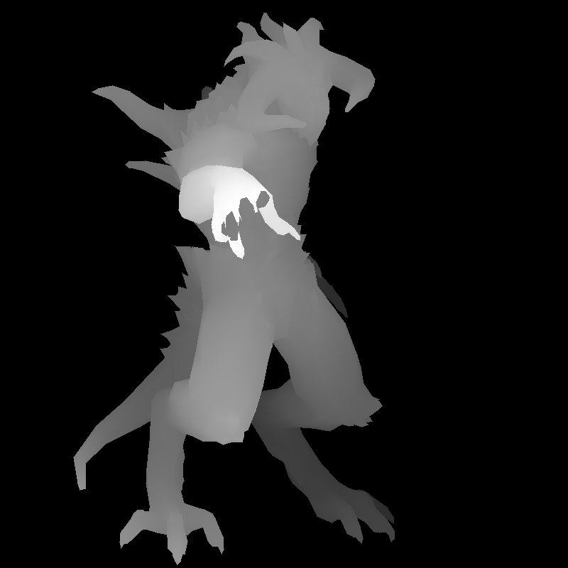

# Toy Renderer

Learning how to do rendering from scratch.

## Progress

### Day 1
First attempt at rendering wireframe.

### Day 2
Found mistake in interpretation of Waveform obj format and fix.

First attempt at "filling" triangles

Finished attempt for filling triangles

### Day 3
Drawing model with filled triangles

Playing around with colors and alpha values

"Wireframe" without calling line()

### Day 4
Cull triangles that are backfacing

Rotate model

### Day 5
Hand of the model is clipped after central projection

Applying rotation later helped abit but still clipping abit

Store z buffer as a vector of floats instead

